<h2>TensorFlow-FlexUNet-Image-Segmentation-Netherland-F3-Interpretation (2025/12/11)</h2>

Toshiyuki Arai 
Software Laboratory antillia.com 
 
This is the first experiment of Image Segmentation for 
<b>Netherland-F3-Interpretation </b>, based on 
our <a href="./src/TensorFlowFlexUNet.py">TensorFlowFlexUNet</a>
 (<b>TensorFlow Flexible UNet Image Segmentation Model for Multiclass</b>)
 and a 512x512 pixels PNG 
<a href="https://drive.google.com/file/d/1BseAaCyJGSuUGpLwT9O_bmr0cF_MvQnu/view?usp=sharing">
Augmented-Netherland-F3-ImageMask-Dataset.zip</a>
, which was derived by us from   
<a href="https://zenodo.org/records/1471548">
Netherlands F3 Interpretation Dataset
</a>  
 
<b>Data Augmentation Strategy</b> 
To address the limited size of images and masks of crosslines of <b>Netherland-F3 Interpretation</b> dataset, 
which contains 951 images and their corresponding masks,
we used our offline augmentation tool <a href="https://github.com/sarah-antillia/Image-Distortion-Tool"> 
Image-Distortion-Tool</a>.   

<b>Actual Image Segmentation for Netherland-F3 Images of 512x512 pixels</b> 
As shown below, the inferred masks predicted by our segmentation model trained on the 
our dataset appear similar to the ground truth masks. 
<b><a href="#color_class_mapping_table">Netherland-F3 color-class-mapping-table</a>
</b>
 
 
<table  cellpadding='5'>
<tr>
<th>Input: image</th>
<th>Mask (ground_truth)</th>
<th>Prediction: inferred_mask</th>
</tr>
<tr>
<td>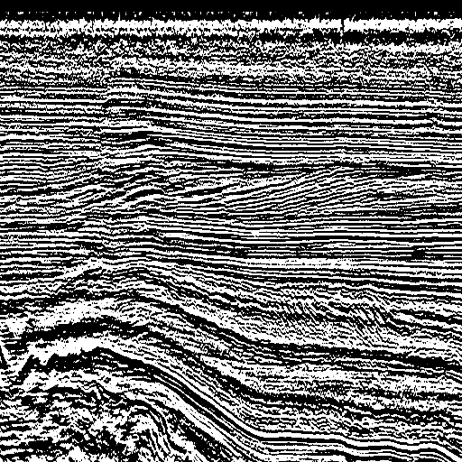</td>
<td>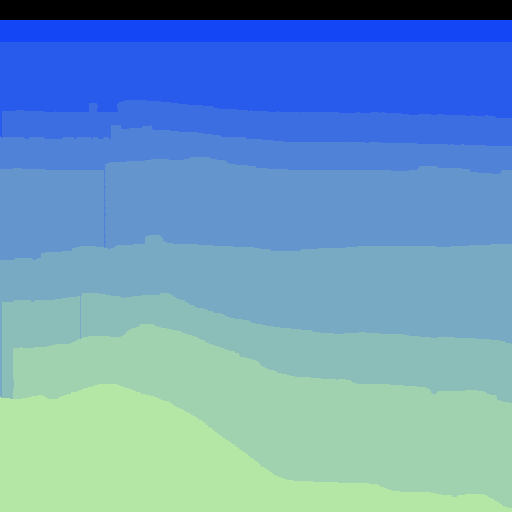</td>
<td>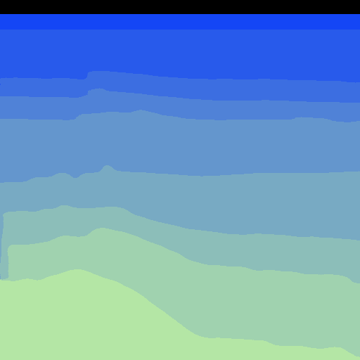</td>
</tr>

<tr>
<td>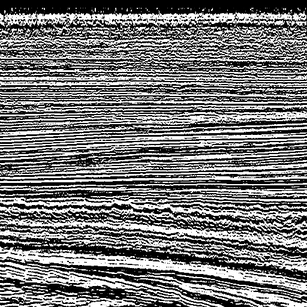</td>
<td>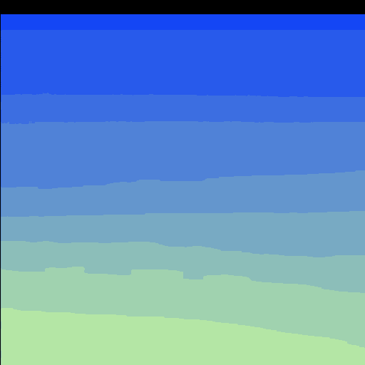</td>
<td>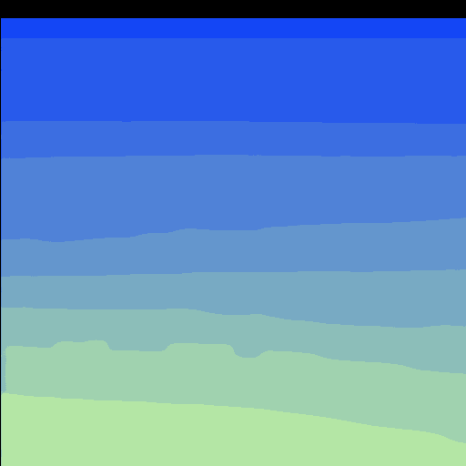</td>
</tr>

<tr>
<td>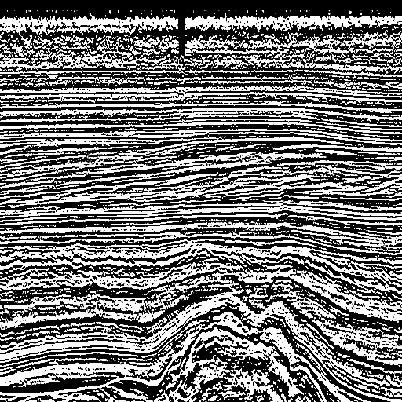</td>
<td>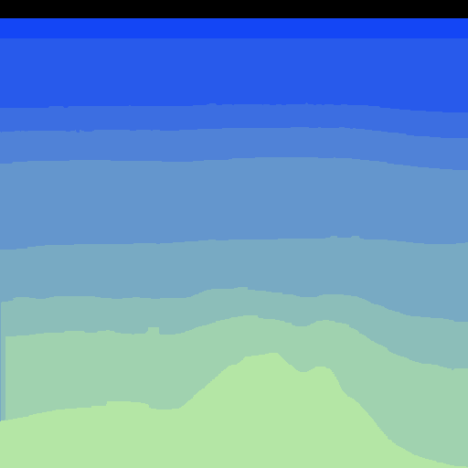</td>
<td>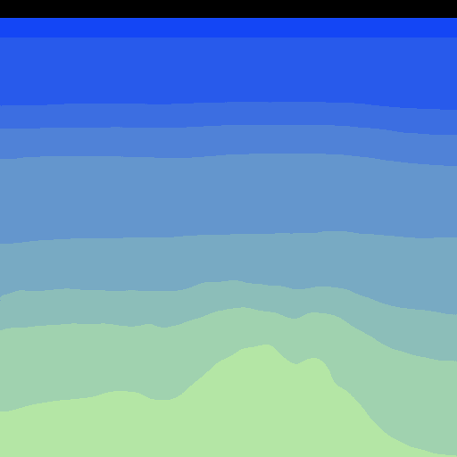</td>
</tr>
</table>

 
<h3>1. Dataset Citation</h3>
The dataset used here was derived from   
<b>crosslines.zip</b> and <b>masks.zip</b> in  
<a href="https://zenodo.org/records/1471548">
Netherlands F3 Interpretation Dataset
</a> 
  
Baroni, Lais,Silva, Reinaldo Mozart,S. Ferreira, Rodrigo,Chevitarese, 
 Daniel,Szwarcman, Daniela, Vital Brazil, Emilio  
<b>Netherlands F3 Interpretation Dataset</b> 
Machine learning and, more specifically, deep learning algorithms have seen remarkable growth 
in their popularity and usefulness in the last years.
 Such a fact is arguably due to three main factors: powerful computers, new techniques to train deeper 
 networks and more massive datasets.   
 Although the first two are readily available in modern computers and ML libraries, the last one 
 remains a challenge for many domains. It is a fact that big data is a reality in almost all fields today, 
 and geosciences are not an exception.  
  However, to achieve the success of general-purpose applications such as ImageNet - for which there 
  are +14 million labeled images for 1000 target classes - we not only need more data, 
  we need more high-quality labeled data.
  
 Such demand is even more difficult when it comes to the Oil & Gas industry, in which confidentiality 
 and commercial interests often hinder the sharing of datasets to others.   
 In this letter, we present the Netherlands interpretation dataset, a contribution to the development 
 of machine learning in seismic interpretation. The Netherlands F3 dataset was acquired in the North Sea,
  offshore Netherlands. The data is publicly available and comprises pos-stack data, eight horizons and 
  well logs of 4 wells. However, for the dataset to be of practical use for our tasks, 
  we had to reinterpret the seismic, generating nine horizons separating different seismic facies intervals.
  
The interpreted horizons were used to create 651 labeled masks for inlines and 951 for crosslines. 
We present the results of two experiments to demonstrate the utility of our dataset.
  
<b>Licence</b> 
<a href="https://creativecommons.org/licenses/by/4.0/legalcode">
Creative Commons Attribution 4.0 International
</a>
 
 
<h3>
2 Netherland-F3 ImageMask Dataset
</h3>
<h4>2.1 Download Netherland-F3-ImageMask-Dataset</h4>
 If you would like to train this Netherland-F3 Segmentation model by yourself,
 please download  our dataset <a href="https://drive.google.com/file/d/1BseAaCyJGSuUGpLwT9O_bmr0cF_MvQnu/view?usp=sharing">
 Augmented-Netherland-F3-ImageMask-Dataset.zip  </a> on the google drive
, expand the downloaded and put it under <b>./dataset</b> folder to be. 
<pre>
./dataset
└─Netherland-F3
    ├─test
    │   ├─images
    │   └─masks
    ├─train
    │   ├─images
    │   └─masks
    └─valid
        ├─images
        └─masks
</pre>
 
<b>Netherland-F3 Statistics</b> 
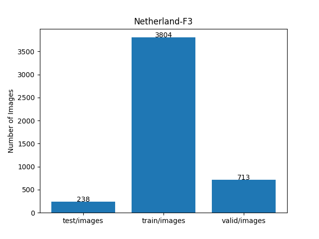 
 
As shown above, the number of images of train and valid datasets is large enough  to use for a training set of our segmentation model.
 
 
<h4>2.2 Netherland-F3 Dataset Derivation</h4>
The original data folder structure of crosslines and masks of <b>Netherland-F3 Interpretation</b> is the following. 
<pre>
./Netherland-F3
├─crosslines
│   ├─crossline_300.tiff
...
│   └─crossline_1250.tiff
└─masks
     ├─crossline_300_mask.png
...
     └─crossline_1250_mask.png

</pre>
We used the following 2 Python scripts to derive our augmented dataset. 
<ul>
<li><a href="./generator/ImageMaskDatasetGenerator.py">ImageMaskDatasetGenerator.py</a></li>
<li><a href="./generator/split_master.py">split_master.py</a></li>
</ul>

As shown below, some original masks contain inappropriate annotation at right side edge regions. 
Therefore, we first generated 462x462
pixels left-side cropped images and masks to exclude the right side edge part from the original one
, and resized them to 512x512 pixels, and finally augmented the resized one by the Generator tool
,which was enabled deformation and distortion augmentation flags, to generate our dataset.  
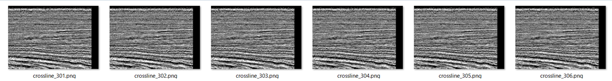 
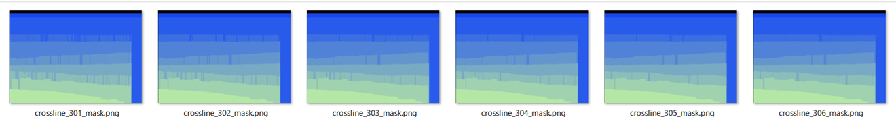 
 
We also used the following <b>Greenish-Blue</b> color-class mapping table to generate our colorized masks, and define a rgb_map for our mask format between 
indexed colors and rgb colors in <a href="./projects/TensorFlowFlexUNet/Netherland-F3/train_eval_infer.config"> 
<b>train_eval_infer.config</b></a> file.  

On the class table, please refer to Figure 3 in <a href='https://arxiv.org/pdf/1904.00770'>
Netherlands Dataset: A New Public Dataset for Machine Learning in Seismic Interpretation</a> 
 
<a id="color_class_mapping_table">Netherland-F3 color-class-mapping-table</a>
<table border=1 style='border-collapse:collapse;' cellpadding='5'>
<caption>Netherland F3 9 classes</caption>
<tr><th>Indexed Color</th><th>Color</th><th>RGB</th><th>Group</th></tr>
<tr><td>1</td><td with='80' height='auto'></td><td>(20, 70, 245)</td><td>Layer_1</td></tr>
<tr><td>2</td><td with='80' height='auto'></td><td>(40, 90, 235)</td><td>Layer_2</td></tr>
<tr><td>3</td><td with='80' height='auto'></td><td>(60, 110, 225)</td><td>Layer_3</td></tr>
<tr><td>4</td><td with='80' height='auto'></td><td>(80, 130, 215)</td><td>Layer_4</td></tr>
<tr><td>5</td><td with='80' height='auto'></td><td>(100, 150, 205)</td><td>Layer_5</td></tr>
<tr><td>6</td><td with='80' height='auto'></td><td>(120, 170, 195)</td><td>Layer_6</td></tr>
<tr><td>7</td><td with='80' height='auto'></td><td>(140, 190, 185)</td><td>Layer_7</td></tr>
<tr><td>8</td><td with='80' height='auto'></td><td>(160, 210, 175)</td><td>Layer_8</td></tr>
<tr><td>9</td><td with='80' height='auto'></td><td>(180, 230, 165)</td><td>Layer_9</td></tr>
</table>
 
<h4>2.3 Train Image and Mask Samples</h4>
<b>Train_images_sample</b> 
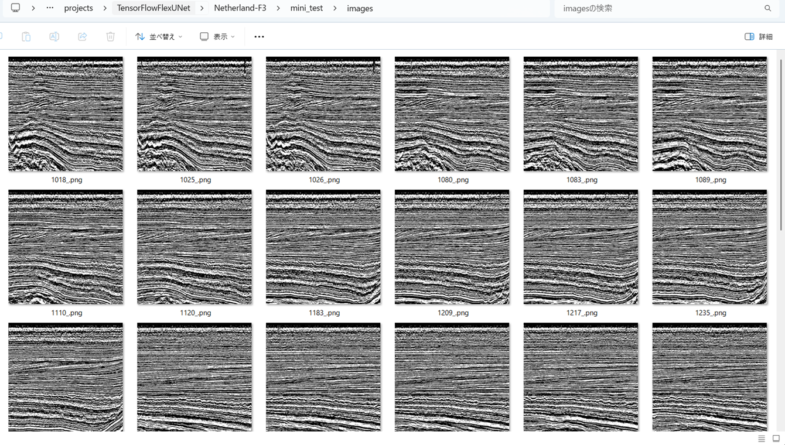
 
<b>Train_masks_sample</b> 
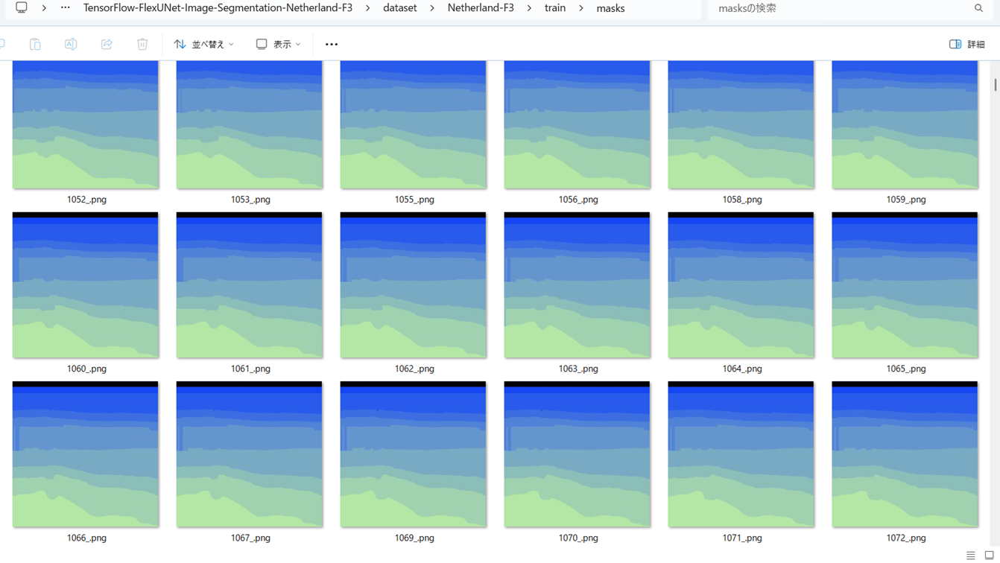
 

<h3>
3 Train TensorFlowUNet Model
</h3>
 We trained Netherland-F3 TensorFlowFlexUNet Model by using the following
<a href="./projects/TensorFlowFlexUNet/Netherland-F3/train_eval_infer.config"> <b>train_eval_infer.config</b></a> file.  
Please move to ./projects/TensorFlowFlexUNet/Netherland-F3 and run the following bat file. 
<pre>
>1.train.bat
</pre>
, which simply runs the following command. 
<pre>
>python ../../../src/TensorFlowFlexUNetTrainer.py ./train_eval_infer.config
</pre>

<b>Model parameters</b> 
Defined a small base_filters=16 and a large base_kernels=(11,11) for the first Conv Layer of Encoder Block of 
<a href="./src/TensorFlowFlexUNet.py">TensorFlowFlexUNet.py</a> 
and a large num_layers (including a bridge between Encoder and Decoder Blocks).
<pre>
[model]
;Specify multiple of 256.
image_width    = 512
image_height   = 512
image_channels = 3
input_normalize = True
num_classes    = 10

base_filters   = 16
base_kernels   = (11,11)
num_layers     = 8
dropout_rate   = 0.05
dilation       = (1,1)

</pre>

<b>Learning rate</b> 
Defined a small learning rate.  
<pre>
[model]
learning_rate  = 0.00007
</pre>

<b>Online augmentation</b> 
Disabled our online augmentation.  
<pre>
[model]
model         = "TensorFlowFlexUNet"
generator     = False
</pre>

<b>Loss and metrics functions</b> 
Specified "categorical_crossentropy" and <a href="./src/dice_coef_multiclass.py">"dice_coef_multiclass"</a>. 
<pre>
[model]
loss           = "categorical_crossentropy"
metrics        = ["dice_coef_multiclass"]
</pre>
<b>Learning rate reducer callback</b> 
Enabled learning_rate_reducer callback, and a small reducer_patience.
<pre> 
[train]
learning_rate_reducer = True
reducer_factor     = 0.4
reducer_patience   = 4
</pre>

<b>Early stopping callback</b> 
Enabled early stopping callback with patience parameter.
<pre>
[train]
patience      = 10
</pre>

<b>RGB Color map</b> 
rgb color map dict for Netherland-F3 1+9 classes.
Please refer to <b><a href="#color_class_mapping_table">Netherland-F3 color-class-mapping-table.</a></b> 
<pre>
[mask]
mask_datatype    = "categorized"
mask_file_format = ".png"
; Netherland-F3 1+9 classes
rgb_map={(0,0,0):0,(20,70,245):1,(40,90,235):2,(60,110,225):3,(80,130,215):4,(100,150,205):5,(120,170,195):6,(140,190,185):7,(160,210,175):8,(180,230,165):9,}
</pre>

<b>Epoch change inference callback</b> 
Enabled <a href="./src/EpochChangeInferencer.py">epoch_change_infer callback (EpochChangeInferencer.py)</a></b>. 
<pre>
[train]
epoch_change_infer       = True
epoch_change_infer_dir   =  "./epoch_change_infer"
num_infer_images         = 6
</pre>

By using this callback, on every epoch_change, the inference procedure can be called
 for 6 images in <b>mini_test</b> folder. This will help you confirm how the predicted mask changes 
 at each epoch during your training process.    

<b>Epoch_change_inference output at starting (epoch 1,2,3)</b> 
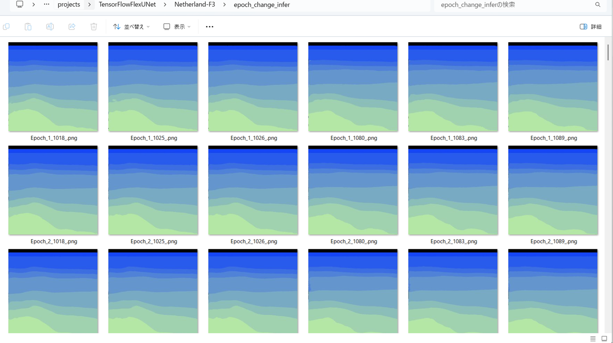 
 
<b>Epoch_change_inference output at middlepoint (epoch 23,24,25)</b> 
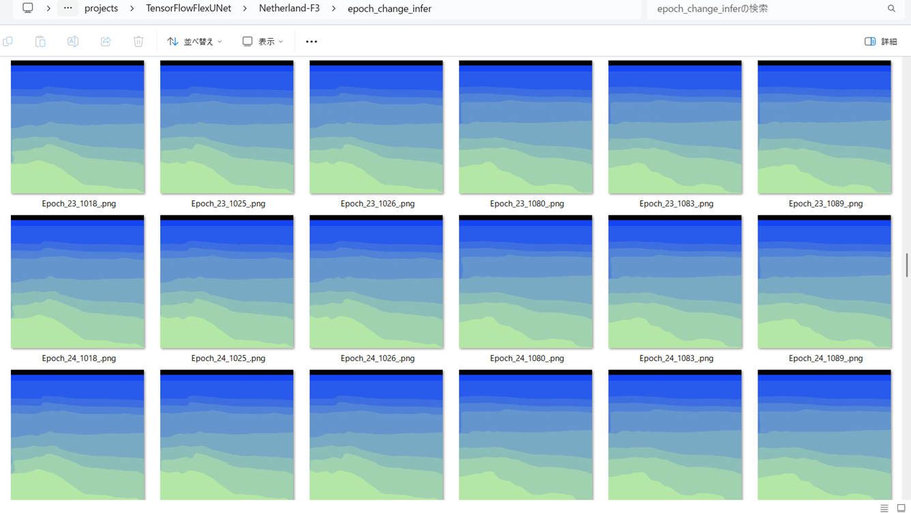 
 

<b>Epoch_change_inference output at ending (epoch 48,49,50)</b> 
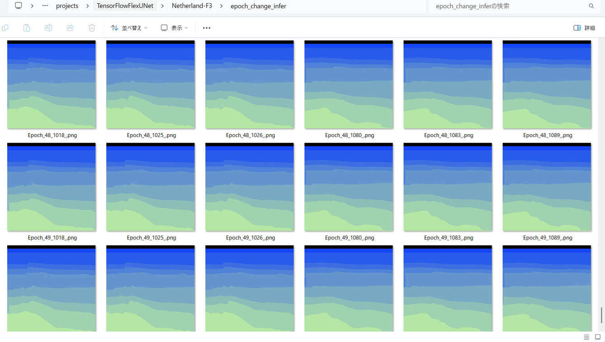 
 

In this experiment, the training process was terminated at epoch 50.  
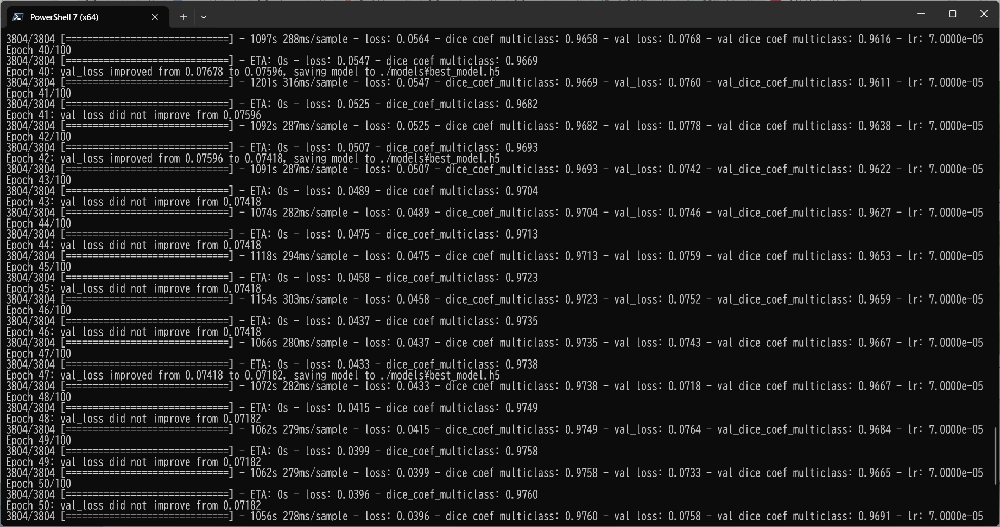 
 

<a href="./projects/TensorFlowFlexUNet/Netherland-F3/eval/train_metrics.csv">train_metrics.csv</a> 
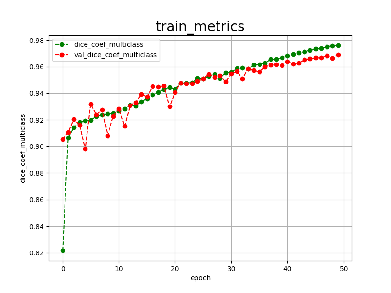 

 
<a href="./projects/TensorFlowFlexUNet/Netherland-F3/eval/train_losses.csv">train_losses.csv</a> 
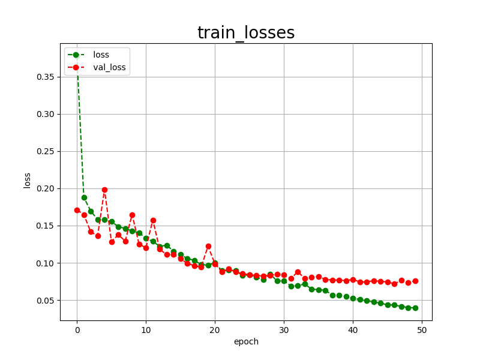 

 

<h3>
4 Evaluation
</h3>
Please move to a <b>./projects/TensorFlowFlexUNet/Netherland-F3</b> folder,
and run the following bat file to evaluate TensorFlowUNet model for Netherland-F3. 
<pre>
./2.evaluate.bat
</pre>
This bat file simply runs the following command.
<pre>
python ../../../src/TensorFlowFlexUNetEvaluator.py ./train_eval_infer.config
</pre>

Evaluation console output: 
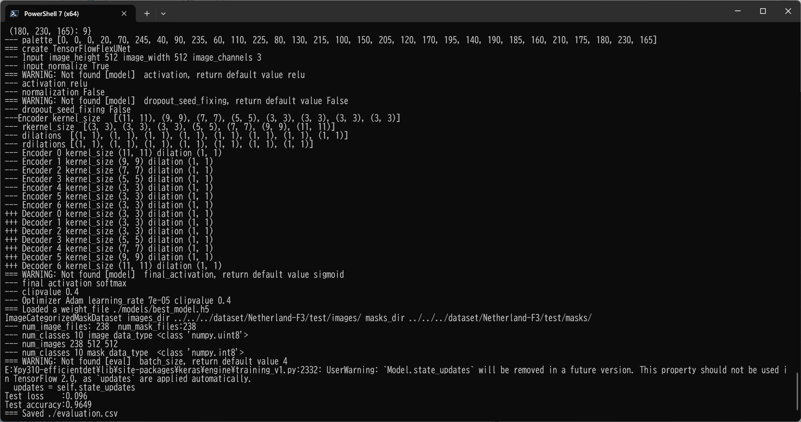
  Image-Segmentation-Netherland-F3

<a href="./projects/TensorFlowFlexUNet/Netherland-F3/evaluation.csv">evaluation.csv</a> 

The loss (categorical_crossentropy) to this Netherland-F3/test was not low, but dice_coef_multiclass high as shown below.
 
<pre>
categorical_crossentropy,0.096
dice_coef_multiclass,0.9649
</pre>
 
<h3>
5 Inference
</h3>
Please move to a <b>./projects/TensorFlowFlexUNet/Netherland-F3</b> folder
, and run the following bat file to infer segmentation regions for images by the Trained-TensorFlowUNet model for Netherland-F3. 
<pre>
./3.infer.bat
</pre>
This simply runs the following command.
<pre>
python ../../../src/TensorFlowFlexUNetInferencer.py ./train_eval_infer.config
</pre>

<b>mini_test_images</b> 
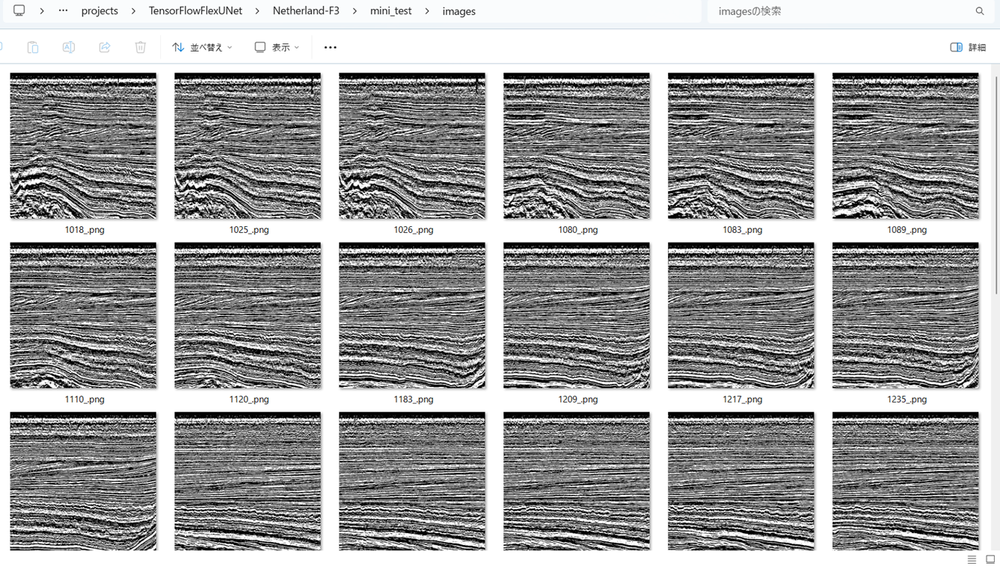 
<b>mini_test_mask(ground_truth)</b> 
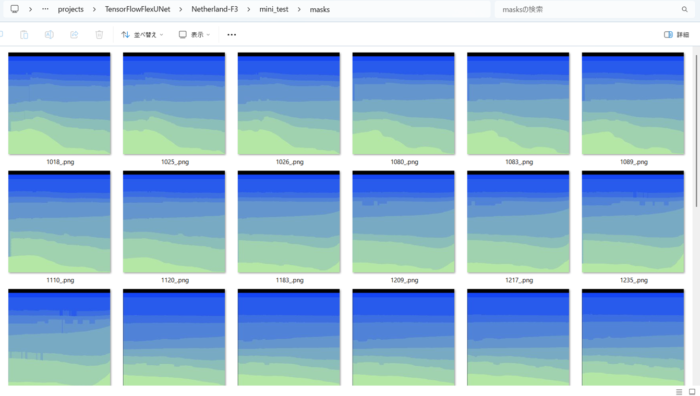 

<b>Inferred test masks</b> 
 
 

<b>Enlarged Netherland-F3 Images of 512x512 pixels</b> 
<b><a href="#color_class_mapping_table">Netherland-F3 color-class-mapping-table</a>
</b>
  
<table  cellpadding='5'>
<tr>
<th>Image</th>
<th>Mask (ground_truth)</th>
<th>Inferred-mask</th>
</tr>
<tr>
<td>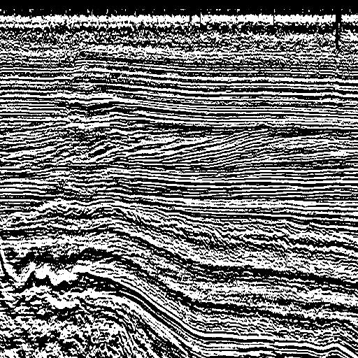</td>
<td>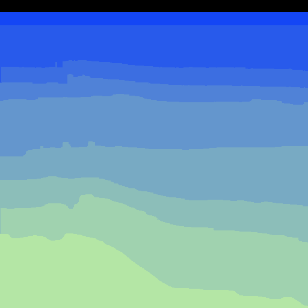</td>
<td>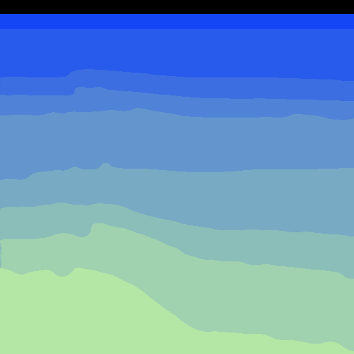</td>
</tr>
<tr>
<td>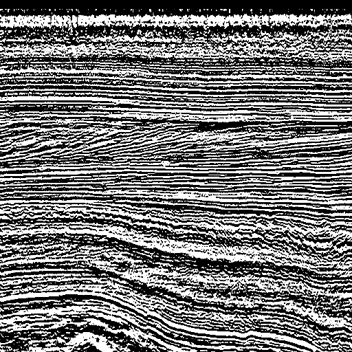</td>
<td>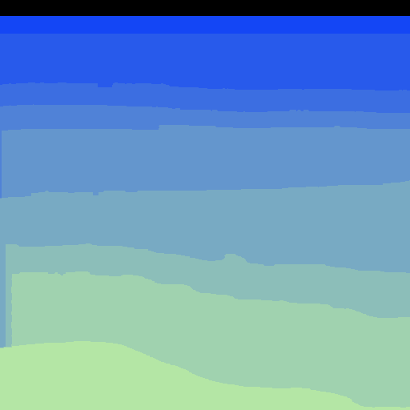</td>
<td></td>
</tr>
<tr>
<td>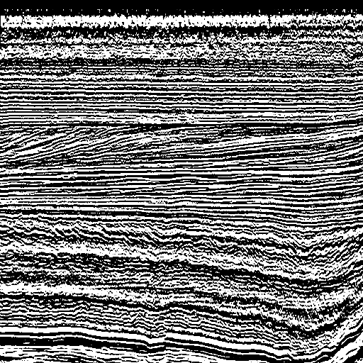</td>
<td>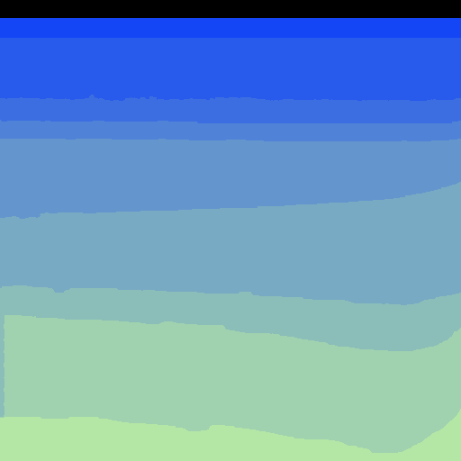</td>
<td></td>
</tr>

<tr>
<td>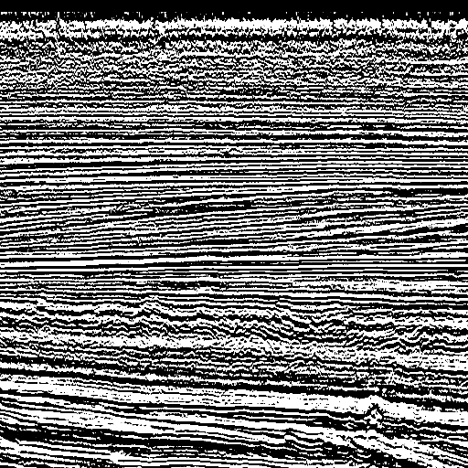</td>
<td>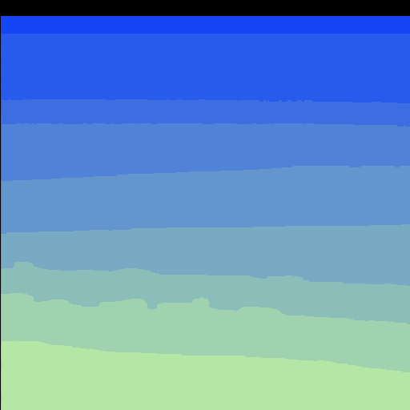</td>
<td>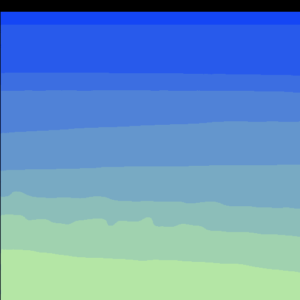</td>
</tr>
<tr>
<td>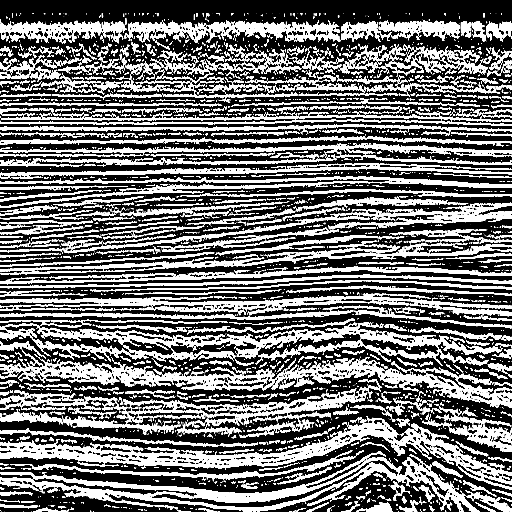</td>
<td>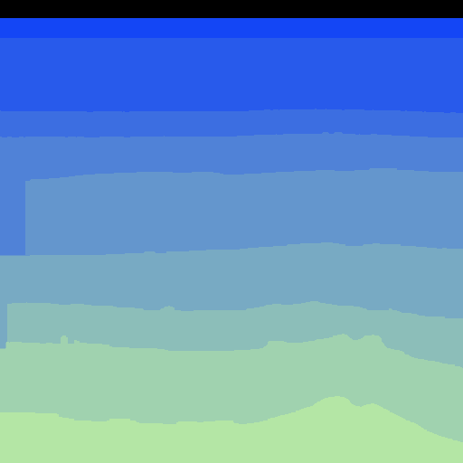</td>
<td>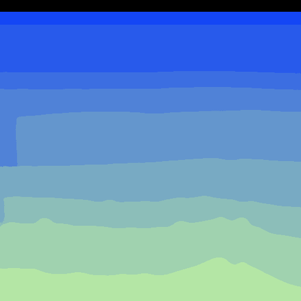</td>
</tr>
<tr>
<td></td>
<td></td>
<td></td>
</tr>

</table>

 

<h3>
References
</h3>
<b>1. facies_classification_benchmark</b> 
Yazeed Alaudaha 
<a href="https://github.com/yalaudah/facies_classification_benchmark">https://github.com/yalaudah/facies_classification_benchmark</a>
 
 
<b>2. A Machine Learning Benchmark for Facies Classification</b> 
Yazeed Alaudah, Patrycja Micha lowicz, Motaz Alfarraj 
<a href="https://arxiv.org/pdf/1901.07659">
https://arxiv.org/pdf/1901.07659</a>
 
 
<b>4. Toward User-Guided Seismic Facies Interpretation With a Pre-Trained Large Vision Model</b> 
Joshua Atolagbe, Ardiansyah Koeshidayatullah 
<a href="https://ieeexplore.ieee.org/document/10909446">
https://ieeexplore.ieee.org/document/10909446
</a>
 
 
<b>5. Netherlands Dataset: A New Public Dataset for Machine Learning in Seismic Interpretation</b> 
Reinaldo Mozart Silva, Lais Baroni, Rodrigo S. Ferreira1, Daniel Civitarese, 
Daniela Szwarcman, Emilio Vital Brazil 
<a href="https://arxiv.org/pdf/1904.00770">
https://arxiv.org/pdf/1904.00770
</a>
 
 
<b>6. TensorFlow-FlexUNet-Image-Segmentation-Model</b> 
Toshiyuki Arai antillia.com  
<a href="https://github.com/sarah-antillia/TensorFlow-FlexUNet-Image-Segmentation-Model">
https://github.com/sarah-antillia/TensorFlow-FlexUNet-Image-Segmentation-Model
</a>
 
 
<b>7. TensorFlow-FlexUNet-Image-Segmentation-Facies</b> 
Toshiyuki Arai antillia.com  
<a href="https://github.com/atlan-antillia/TensorFlow-FlexUNet-Image-Segmentation-Facies">
https://github.com/atlan-antillia/TensorFlow-FlexUNet-Image-Segmentation-Facies
</a>
 
 
